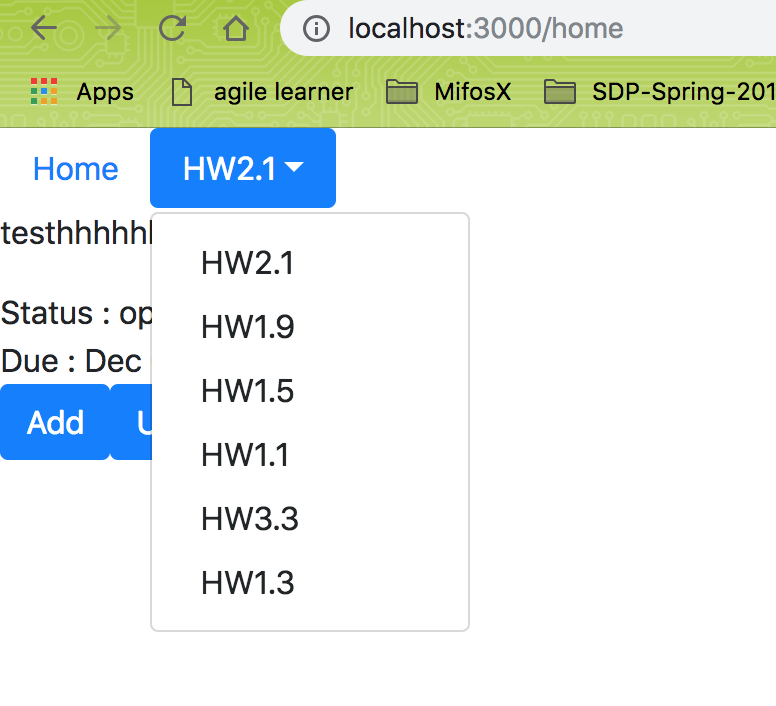
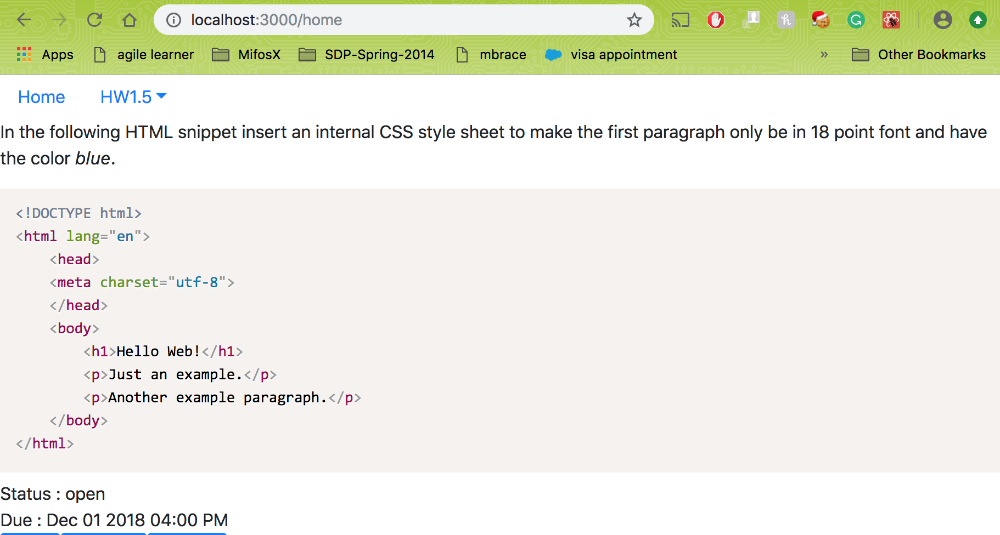
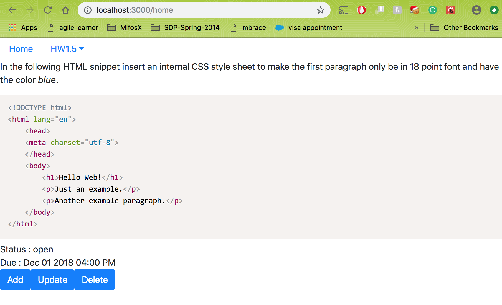
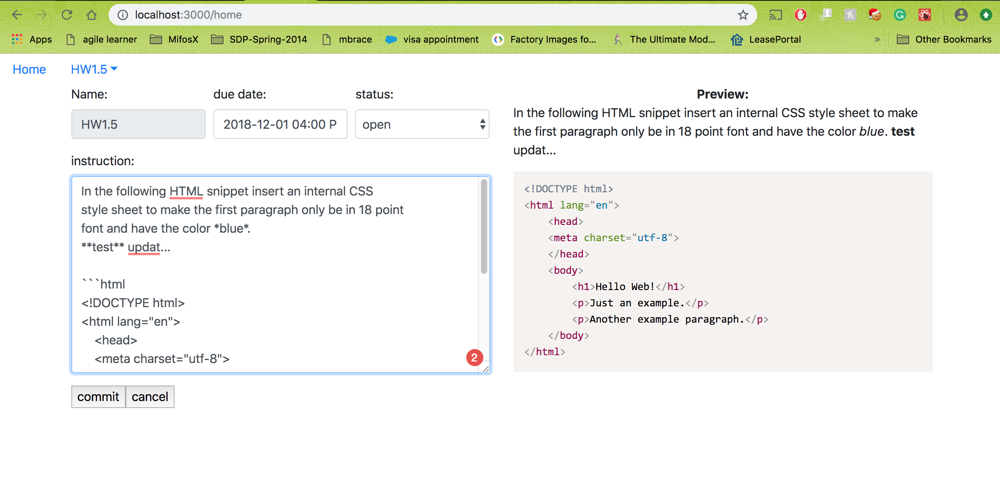
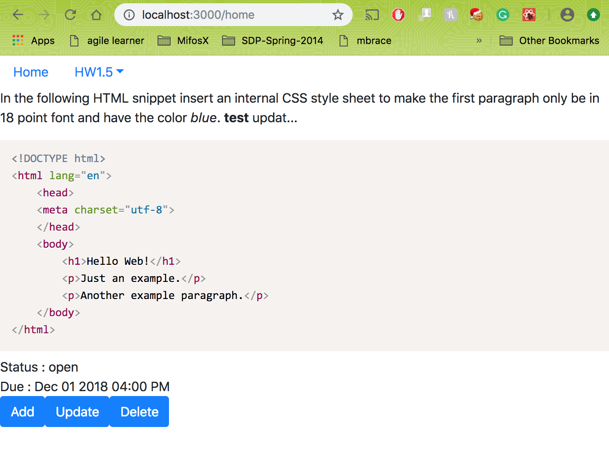
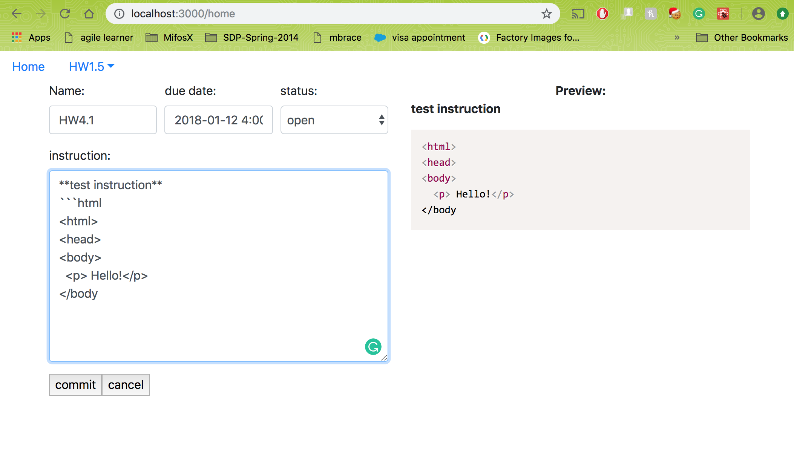
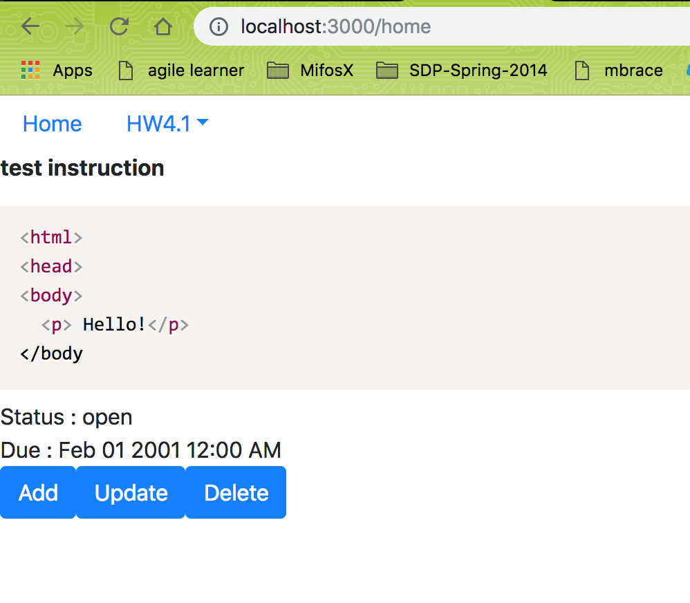
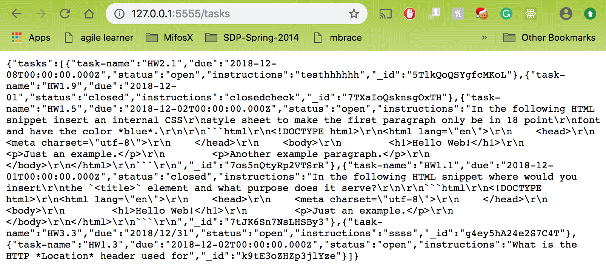
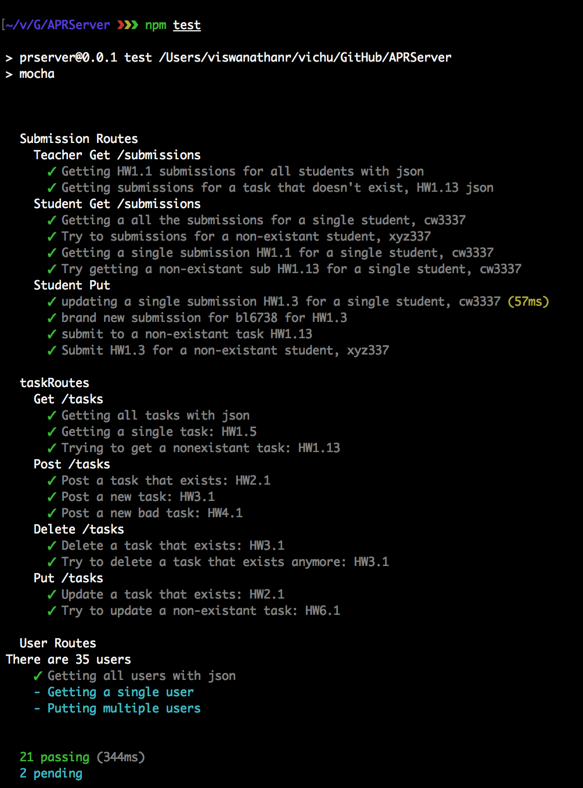

# Homework 9 CS651

**Sandhya Sankaran**

**NetID: cq9346**


## Question 1

### a) Screenshot of tasks added

 

Code:

```javascript
render() {
    let listItems = this.state.sampleTasks.map((task, index, array) => {
      return <NavDropdown.Item eventKey={index} key={`task${index}`} onSelect={k => this.showTask(k)}>
        {task["task-name"]}</NavDropdown.Item>
    });
    if (this.state.sampleTasks.length <=0){
        return <div> 
        {this.showTaskinfo()}
        </div>
    }
    else{
    return <div>
      <Nav variant="pills">
        <Nav.Item >
          <Nav.Link eventKey="a" href="/home" >
            Home
            </Nav.Link>
        </Nav.Item>
        <NavDropdown title={this.state.sampleTasks[this.state.currentTask]["task-name"]} id="nav-dropdown" >
          {listItems}
        </NavDropdown>
      </Nav>
      {this.showTaskinfo()}
      
    </div>
```


### b) Screenshot of markdown translated:

 

Code:

```javascript
import ReactCommonmark from 'react-commonmark';
render(){
 var markdownInstruction = this.props.sampleTasks[this.props.currentTask].instructions;
  var rawHtml = <div className="language-html">
                <ReactCommonmark source={markdownInstruction} />
            </div>
 return <div>
  {rawHtml}
   Status : {this.props.sampleTasks[this.props.currentTask].status} <br/>
  Due    : <Moment format="MMM DD YYYY hh:mm A">{this.props.sampleTasks[this.props.currentTask].due}</Moment><br />
}              

```


### c) Screenshot of read view

 

Read code:

```javascript
export class TaskViewer extends React.Component {
    constructor(props) {
        super(props);
    }
    componentDidUpdate() {
        Prism.highlightAll();
    }
    componentDidMount() {
        Prism.highlightAll();
    }

    render() {
        if (this.props.sampleTasks.length === 0) {
            var markdownInstruction = ''
            var rawHtml = <div className="language-html">
                <ReactCommonmark source={markdownInstruction} />
            </div>

            return <div>
                {rawHtml}
                <p><Button onClick ={this.addTask}>Add</Button></p>
            </div>
        }
        else {
            var markdownInstruction = this.props.sampleTasks[this.props.currentTask].instructions;
            var rawHtml = <div className="language-html">
                <ReactCommonmark source={markdownInstruction} />
            </div>

            return <div>
               
                {rawHtml}
                Status : {this.props.sampleTasks[this.props.currentTask].status} <br/>
                Due    : <Moment format="MMM DD YYYY hh:mm A">{this.props.sampleTasks[this.props.currentTask].due}</Moment><br />
                <ButtonToolbar>
                    <Button onClick ={this.addTask}>Add</Button>
                    <Button onClick={this.updateTask}>Update</Button>
                    <Button onClick={this.removeTask} disabled={this.props.sampleTasks.length <= 0}>Delete</Button>
                </ButtonToolbar>

            </div>
        }

    }
}

```

### d) Code:

```javascript
 removeTask() {
    if (this.state.sampleTasks.length > 0) {
      //console.log(this.state.allQuestions.length);
      if (this.state.currentTask > 0) {
        this.state.sampleTasks.splice(this.state.currentTask, 1);
        this.setState({ currentTask: this.state.currentTask - 1 });
      }
      else {
        this.state.sampleTasks.splice(this.state.currentTask, 1);
        this.setState({ currentTask: this.state.currentTask });

      }
    }
  }
```
### e) Screenshot of update view

 


Code update task:

```javascript
export class TaskUpdate extends React.Component {
    constructor(props) {
        super(props);
        if (this.props.mode === "update") {
            this.state = { task: this.props.task, mode: this.props.mode }
        }
        //console.log(this.state.task);
        this.handleChange = this.handleChange.bind(this);
        this.commitValue = this.commitValue.bind(this);
        this.cancelTask = this.cancelTask.bind(this);

    }
    handleChange(event) {

        let task = Object.assign({}, this.state.task);    //creating copy of object
        task[event.target.name] = event.target.value;                        //updating value
        this.setState({ task });

    }
     commitValue(event) {
        this.props.sampleTasks.splice(this.props.currentTask, 1, this.state.task);
        alert("The task has been updated");
        this.props.update();
        event.preventDefault();
        
    }
    render() {

        //let dueTime = moment(data.due).utc().format('HH:mm');
        if (this.props.mode === "update") {
            let due = moment(this.state.task["due"]).format('YYYY-MM-DD hh:mm A');
            var markdownInstruction = this.state.task["instructions"]
            var rawHtml = <div className="language-html">
                <ReactCommonmark source={markdownInstruction} />
            </div>

            if (this.state.task["status"] === "closed") {
                var op = "open";
            }
            else {
                var op = "closed";
            }
            return <div>
                  <Form>
                    <Form.Row>
                    <Form.Group as={Col}>
                      <Form.Label>
                       Name:</Form.Label>
                        <Form.Control name="task-name" value={this.state.task["task-name"]}
                         disabled="disabled" />
                    </Form.Group>
                    <Form.Group as={Col}>
                     <Form.Label>
                       due date: </Form.Label>
                      <Form.Control name="due" value={due} onChange={this.handleChange} />
                    </Form.Group>
                    <Form.Group as={Col}>
                     <Form.Label>
                      status:</Form.Label>
                     <Form.Control name="status" as="select" onChange={this.handleChange}>
                      <option defaultValue={this.state.task["status"]}>{this.state.task["status"]}</option>
                      <option value={op}>{op}</option>
                      </Form.Control>
                    </Form.Group>
                      </Form.Row>
                      <Form.Row><Form.Group as={Col} ><Form.Label>
                        instruction:</Form.Label>
                        <Form.Control as="textarea" name="instructions" value={this.state.task["instructions"]}
                        rows="10" s="25" onChange={this.handleChange} /> </Form.Group>
                      </Form.Row>
                        <input type="button" value="commit" onClick={this.commitValue} />
                        <input type="button" value="cancel" onClick={this.cancelTask} />
                    </Form>
                      <strong><center>Preview:</center></strong>
                    {rawHtml}     
            </div>
        }
    


```

### f) Screenshot of add view

 
 

Code add task:

```javascript
export class TaskUpdate extends React.Component {
    constructor(props) {
        super(props);
      { if(this.props.mode === "add") {
            this.state = { "task-name": '', due: '', status: 'open', instructions: '' }
        }
        //console.log(this.state.task);
        this.handleChange = this.handleChange.bind(this);
        this.commitValue = this.commitValue.bind(this);
        this.cancelTask = this.cancelTask.bind(this);

    }
     addChange(event){
        const target = event.target;
        const value = target.value;
        const name = target.name;
    
    
        this.setState({
          [name]: value
        });
      
  }

  addValue(event){
    this.props.sampleTasks.push({ "task-name": this.state["task-name"], due: this.state.due ,
    status:this.state.status, instructions:this.state.instructions});
    this.props.update();
    event.preventDefault();

  }

    render() {

        var markdownInstruction = this.state.instructions;
            var rawHtml = <div className="language-html">
                <ReactCommonmark source={markdownInstruction} />
            </div>
            if (this.state["status"] === "closed") {
                var op = "open";
            }
            else {
                var op = "closed";
            }

            return <div>
              <Form>
                <Form.Row>
                <Form.Group as={Col}>
                  <Form.Label>
                    Name:</Form.Label>
                      <Form.Control name="task-name" value={this.state["task-name"]} onChange={this.addChange} />
                </Form.Group>
                <Form.Group as={Col}>
                   <Form.Label>
                      due date: </Form.Label>
                      <Form.Control name="due" value={this.state.due} onChange={this.addChange} rows="1" />
                </Form.Group>
                <Form.Group as={Col}>
                  <Form.Label>status:</Form.Label>
                  <Form.Control name="status" as="select" onChange={this.addChange} >
                  <option defaultValue={this.state.status}>{this.state.status}</option>
                  <option value={op}>{op}</option>

                  </Form.Control>
                </Form.Group>
                </Form.Row>
                <Form.Row><Form.Group as={Col} ><Form.Label>
                  instruction:</Form.Label>
                  <Form.Control as="textarea" name="instructions" value={this.state.instructions}
                    rows="10" s="25" onChange={this.addChange} /> </Form.Group>
                </Form.Row>
                <input type="button" value="commit" onClick={this.addValue} />
                <input type="button" value="cancel" onClick={this.cancelTask} />

              </Form>         
               <strong><center>Preview:</center></strong>
              {rawHtml}
            </div>
        } 
```


## Question 2

### a) Screenshot of tasks

 

### screenshot of test results:


 

### b) proxy added:

```javascript
"proxy": "http://127.0.0.1:5555";
```

### c)Fetch call for getting tasks:

Added the fetch call in App.js in the componentDidMount() lifecycle function since this execute immediatly once the component is created and the tasks are got from the server.

```javascript
componentDidMount(){
      let _this = this
    fetch('/tasks').then(response => response.json()).then(function(data) {

        console.log("this is what we got" +data);
        _this.setState({sampleTasks: data.tasks});
        
      })
  }
  ```

### d)Fetch call for updating tasks:

Added the fetch call in the event handler of the update button.When the update button is clicked, the fetch call with PUT method sends the request body with the task object to be updated in the server and receives a response. If the response status is OK, the promise resolves and .then executes.

```javascript
commitValue(event) {
        const _this = this;
        const taskName = this.state.task["task-name"];
        const taskToUpdate = this.state.task;
        fetch('/tasks/' + taskName, {
            method: 'PUT',
            headers: {
                "Content-type": "application/json"
            },
            body: JSON.stringify(taskToUpdate)
        }).then(function (response) {
            _this.props.sampleTasks.splice(_this.props.currentTask, 1, taskToUpdate);
            _this.props.update();
            event.preventDefault();
        });

    }
  ```

### e)Fetch call for adding tasks:

Added the fetch call in the event handler of the Add button. When the Add button is clicked, the fetch call with POST method sends the request body with the task object to be added in the server and receives a response. If the response status is OK, the promise resolves and .then executes.

```javascript
 addValue(event) {
        let _this = this
        let taskToSave = {
            "task-name": this.state["task-name"], due: this.state.due,
            status: this.state.status, instructions: this.state.instructions
        };
        fetch('/tasks', {
            method: 'POST',
            headers: {
                "Content-type": "application/json"
            },
            body: JSON.stringify(taskToSave)
        }).then(function (response) {
            _this.props.sampleTasks.push(taskToSave);
            _this.props.update();
            event.preventDefault();
        });

    }
  ```
### f)Fetch call for deleting tasks:

Added the fetch call in the event handler of the Delete button. When the Delete button is clicked, the fetch call with DELETE method sends the request body with the task object to be deleted in the server and receives a response. If the response status is OK, the promise resolves and .then executes.

```javascript
   removeTask() {
        const _this=this;
        const taskName = this.state.sampleTasks[this.state.currentTask]["task-name"];
        const taskToDelete = this.state.sampleTasks[this.state.currentTask];
        fetch('/tasks/'+taskName, {
            method: 'DELETE',
            headers: {
                "Content-type": "application/json"
            },
            body: JSON.stringify(taskToDelete)
        }).then(function(response) {
            if (_this.state.sampleTasks.length > 0) {
                if (_this.state.currentTask > 0) {
                  _this.state.sampleTasks.splice(_this.state.currentTask, 1);
                  _this.setState({ currentTask: _this.state.currentTask - 1});
                }
                else {
                  _this.state.sampleTasks.splice(_this.state.currentTask, 1);
                  _this.setState({ currentTask: _this.state.currentTask });
          
                }
              }
             
        });
  }
  ```


